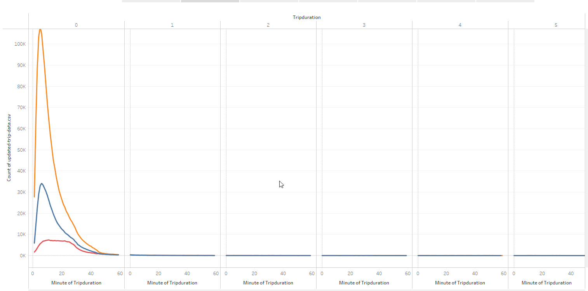

# Bikesharing System Analysis

## Project description

The purpose of this analysis is to understand trends with the current CitiBike ridesharing platform, currently used in New York City (specifically Manhattan, along with parts of Brooklyn and Queens).  The analysis is intended to be leveraged for the purposes of potentially launching a new bikeshare network in another smaller metro area (Des Moines, IA).

## Tools

* Tableau Public 2021.4.3
* Jupyter Lab 
* Python, Pandas

## The Data

Citibike - full anonymized ride tracking data set from August 2019.  Full dataset is available [here](https://ride.citibikenyc.com/system-data).

## Analysis

All figures displayed below are sourced from the Tableau Public workbook created for this analysis, which is located [here](https://public.tableau.com/app/profile/eric.spoerner/viz/CitiBikeChallenge_16455795787410/Story1).

The vast majority of trips are extremely short, with the vast majority of rides taking less than 15 minutes.  This occurs both in aggregate, and broken down by genders, as demonstrated in Figures 1 and 2.

### Fig 1 - ride duration

### Fig 2 - ride duration by gender

Further analysis was conducted on ride volume based on the dimensions of day/time of week, gender of rider, and type of rider (Subscriber vs Customer).  Two major patterns of rides emerge from this data:
* Non-subscriber rides (presumably tourists and other casual users), concentrated on weekends throughout the day
* Subscribers using the bikes for weekday commuting, predominantly men.

### Fig 3 - Trip by time of week

### Fig 4 - Trips by time of week per gender

### Fig 5 - Trips by day of week per gender

Perhaps unsurprisingly, starting and ending locations are both most likely in Lower and Midtown Manhattan, mostly along Broadway and the Hudson River, as well as along Central Park West and Fifth Ave.  These areas represent a combination of tourist districts and major hubs for business.

### Fig6 - Starting locations

### Fig7 - Ending locations

## Future analysis

Additional questions that can help clarify usage patterns include:
* Further analysis of user patterns between "quick trips" and longer/more regular commuting. What are the most common pathways for commuters (Subscriber accounts with typical M-F 9-5 behavior patterns)
* Synthesize with weather data to understand how weather patterns influence ridership, especially combined with the additional dimensions of gender and subscription type.