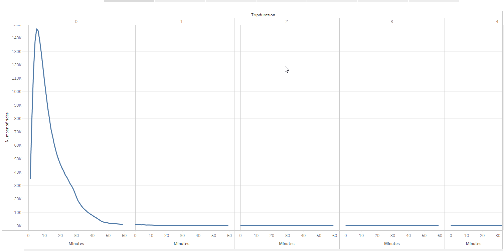
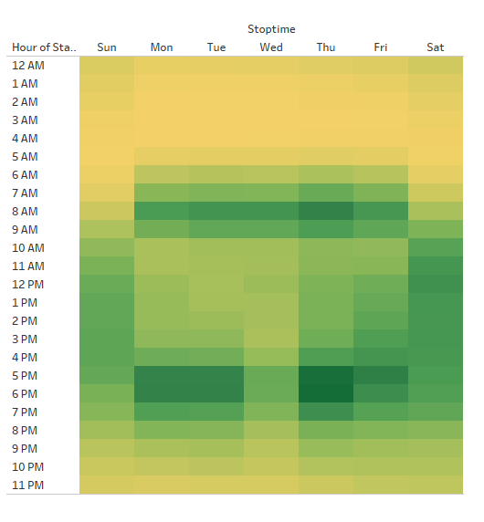
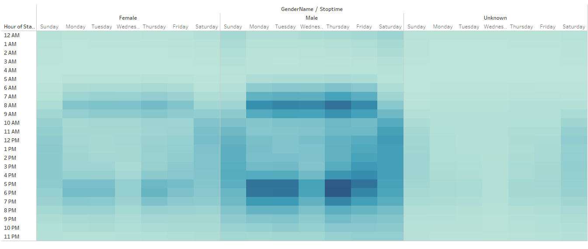
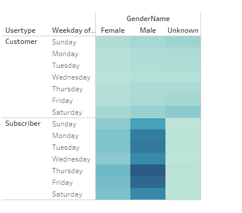
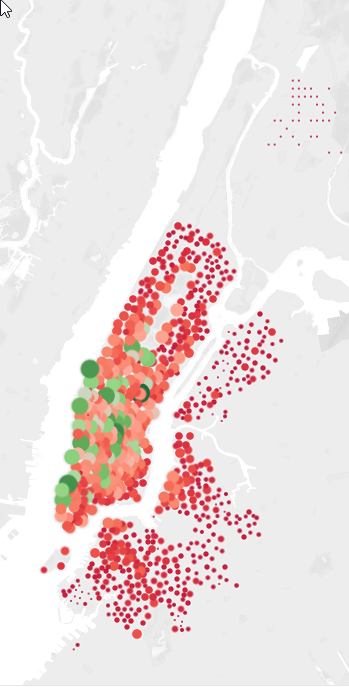
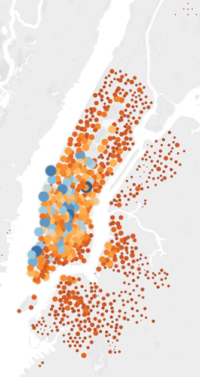

# Bikesharing System Analysis

## Project description

The purpose of this analysis is to understand trends with the current CitiBike platform, currently used in New York City (specifically Manhattan, along with parts of Brooklyn and Queens).  The analysis is intended to be leveraged for the purposes of potentially launching a new bikeshare network in another smaller metro area (Des Moines, IA).

## Tools

* Tableau Public
* Jupyter Lab
* Python, Pandas

## The Data

Citibyike - full anonymized ride tracking data set from August 2019.  URL pending

## The thing
[Tableau dashboard here](https://public.tableau.com/app/profile/eric.spoerner/viz/CitiBikeChallenge_16455795787410/Story1)

## Analysis

* The vast majority of trips are extremely short.
### Fig 1 - ride duration

### Fig 2 - ride duration by gender

* Men seem to use the bikes more for commuting.
### Fig 3 - Trip by time of week

### Fig 4 - Trips per gender per hour

### Fig 5 - Trips by gender per weekday

* Starting and ending locations are both most likely in Lower and Midtown Manhattan, mostly along Broadway and the Hudson River, as well as along Central Park West and Fifth Ave.
### Fig6 - Starting locations

### Fig7 - Ending locations

## Future analysis

* WHat are the most common pathways for commuters (assume members from )
* Synthesize with weather data
